# Livrable Microsoft Active Directory

## Sommaire:

1. [Preparation de l'environnement](#preparation-de-lenvironnement)  
1.1 [Installation de Windows Server](#installation-de-windows-server)  
1.2 [Ajout des rôles nécessaires](#ajout-des-rôles-nécessaires)  
1.3 [Promotion du serveur en contrôleur de domaine](#promotion-du-serveur-en-contrôleur-de-domaine)    
1.4 [Installation d'un membre du domaine](#installation-dun-membre-du-domaine)  

2. [Configuration de l'Active Directory](#configuration-de-lactive-directory)   
2.1 [Création d'unités d'organisation](#création-dunités-dorganisation)  
2.2 [Ajout d'utilisateurs](#ajout-dutilisateurs)  
2.3 [Création de groupes AD](#création-de-groupes-ad)  

3. [Configuration du service DNS)](#configuration-du-service-dns)  
3.1 [Configurer le redirecteur DNS](#configurer-le-redirecteur-dns)  
3.2 [Ajout d'enregistrement DNS](#ajout-denregistrement-dns)  
3.3 [Test de résolution DNS](#test-de-résolution-dns)  

4. [Configuration du service DHCP](#configuration-du-service-dhcp)  
4.1 [Création d'une plage d'adresses](#création-dune-plage-dadresses)  
4.2 [Ajout d'options DHCP](#ajout-doptions-dhcp)  
4.3 [Test de configuration DHCP](#test-de-configuration-dhcp)  
 
5. [Gestion des permissions d'accès](#gestion-des-permissions-dacces)  
5.1 [Création des dossiers communs](#création-des-dossiers-communs)  
5.2 [Définition des permissions NTFS](#définition-des-permissions-ntfs)  
5.3 [Test d'accès](#test-daccès)  

6. [Configuration des stratégies de groupe](#configuration-des-stratégies-de-groupe)  
6.1 [Création des GPO pour les départements](#création-des-gpo-pour-les-départements)  
6.2 [Liaison des GPO aux unités d'organisation](#liaison-des-gpo-aux-unités-dorganisation)  
6.3 [Test des GPO](#test-des-gpo)  

7. [Vérifications et tests](#vérifications-et-tests)  
7.1 [Tester les connexions utilisateurs](#tester-les-connexions-utilisateurs)  
7.2 [Documenter les résultats](#documenter-les-résultats)  

## 1. Preparation de l'environnement

### 1.1 Installation de Windows Server

Pour commencer, nous allons installer un serveur Windows Server 2019.  
On commence par télécharger l'image ISO de Windows Server 2019 sur le site de Microsoft.  
Une fois installée, on s'assure que le réseau est bien configuré et que le serveur a accès à internet.  
Pour cela, on crée un Nat Network, défini sur `192.168.1.0/24` comme précisé.  

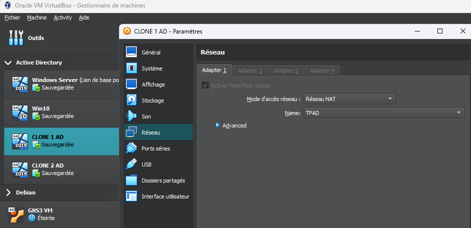

On vérifie la configuration du réseau, est surtout que **DHCP est désactivé**.

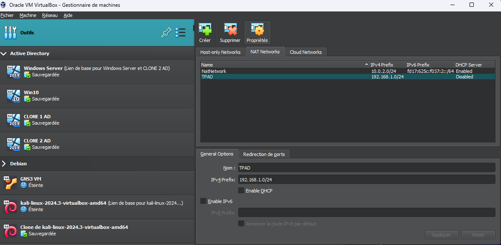

Une fois fait, on peut commencer le paramétrage IP de Windows Server lui-même.
Je mets en place une ip statique:

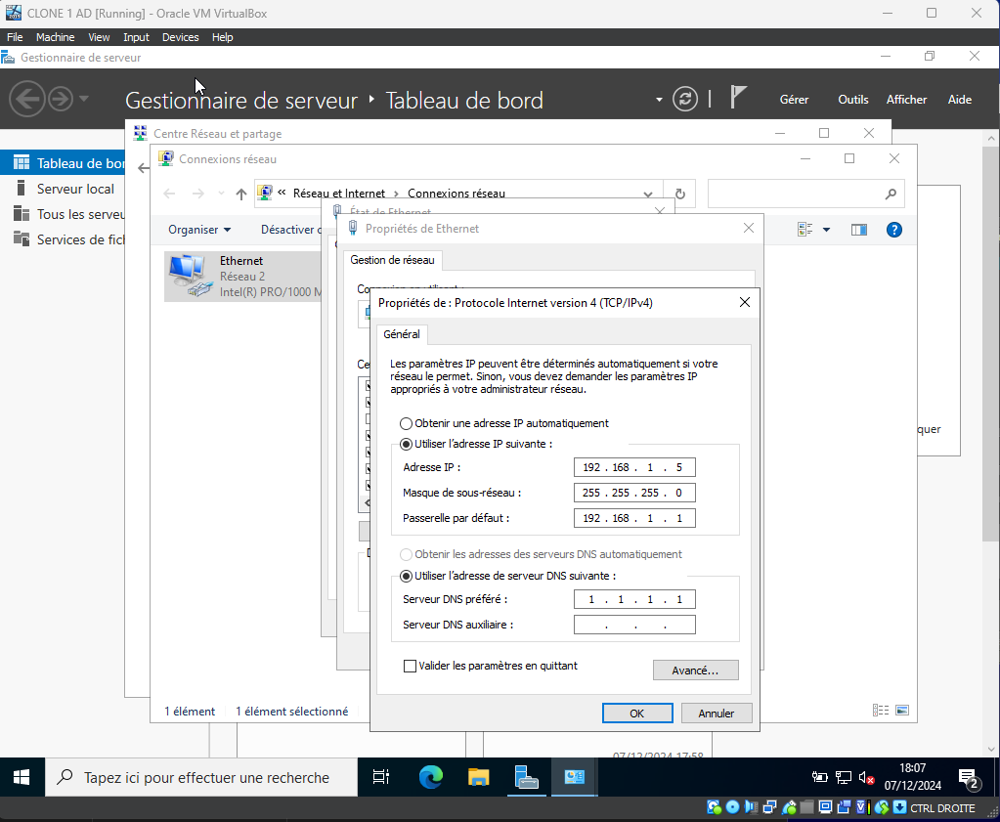

On n'oublie pas également de faire les mises à jour.

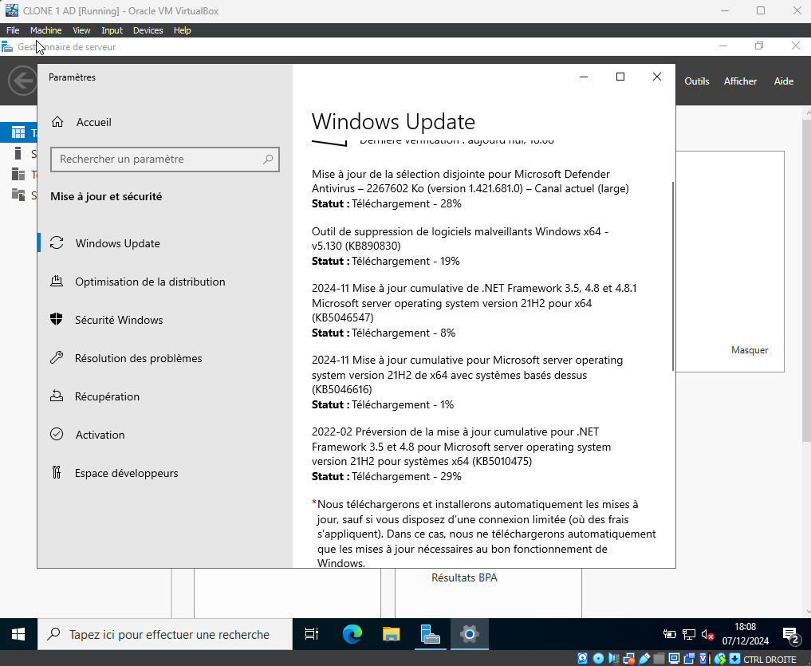

### 1.2 Ajout des rôles nécessaires

Ajoutons les rôles nécessaires pour notre serveur.  
Pour cela, on se rend dans le gestionnaire de serveur, et on ajoute les rôles suivants:  

- Active Directory Domain Services
- DNS Server
- DHCP Server

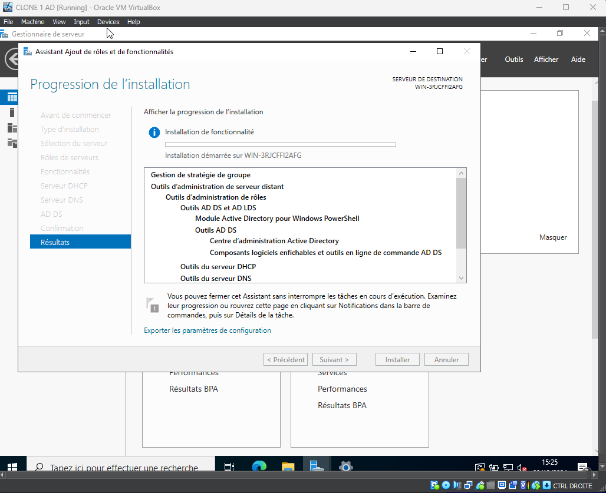

On laisse les options par défaut pour le reste de la configuration.  
Une fois l'installation terminée, on redémarre le serveur et on vérifie que tout est bien installé.

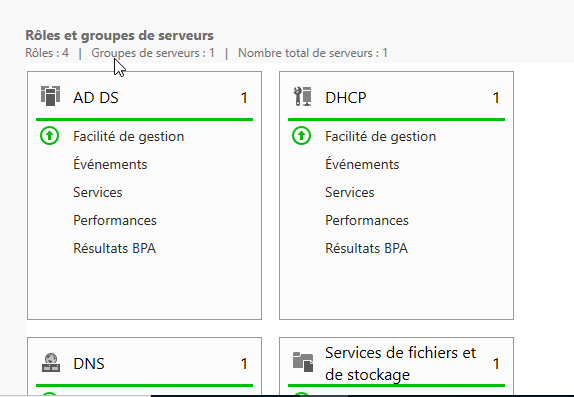

### 1.3 Promotion du serveur en contrôleur de domaine

Pour cela, il suffit de cliquer sur `Promote this server to a domain controller` dans le gestionnaire de serveur, lorsqu'on voit la notification

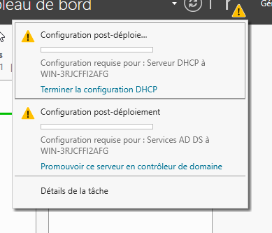

On met donc en place le déploiement en indiquand le domaine de la forêt. (`techcorp.local`)

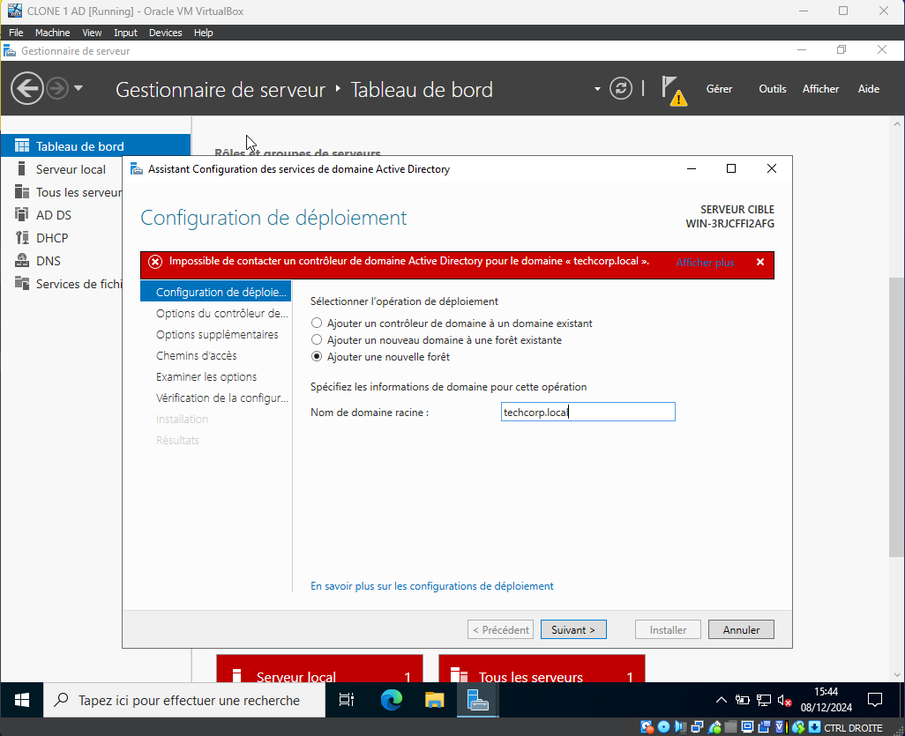

### 1.4 Installation d'un membre du domaine

Maintenant, ajoutons un membre au domaine.  
Pour cela, nous n'avons besoin que d'une machine virtuelle avec Windows 10.

On commence par configurer le réseau de la machine virtuelle, en lui attribuant une IP statique.  (`192.168.1.6` pour notre exemple, **De toute façon cette ip changera plus tard avec le DHCP**)  
On n'oublie pas de mettre l'ip du serveur DNS en tant que DNS préféré !

Ensuite, on rejoint la machine au domaine en allant dans les paramètres système, et en cliquant sur `Modifier les paramètres`. (Système > Informations système > Domaine ou groupe modifier > membre d’un : on coche domaine et on entre le domaine)
Une fois fait, un message apparaît indiquant que ça a fonctionné.

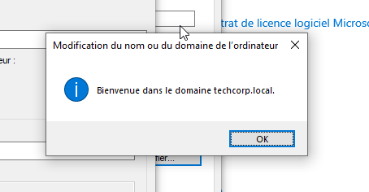

On redémmare la machine, et on peut voir que la machine nous propose un autre utilisateur pour se connecter, et il est écrit "Connectez vous à : TECHCORP".

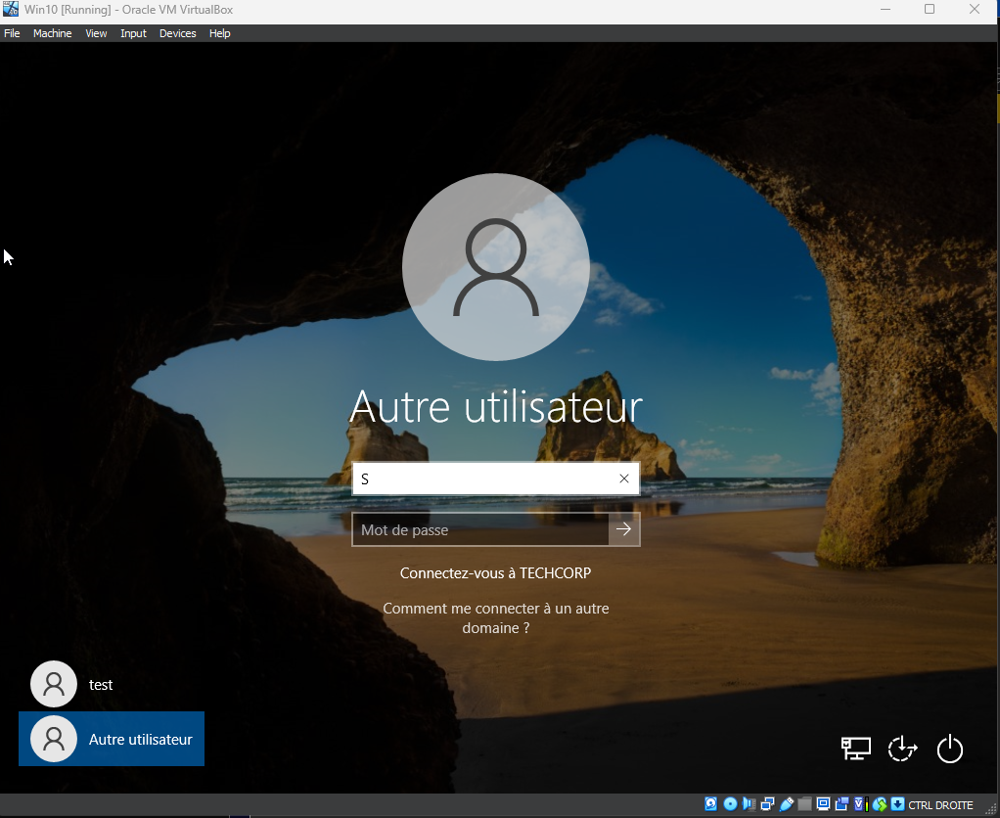

Côté serveur, on peut voir que la machine est bien ajoutée dans les ordinateurs.

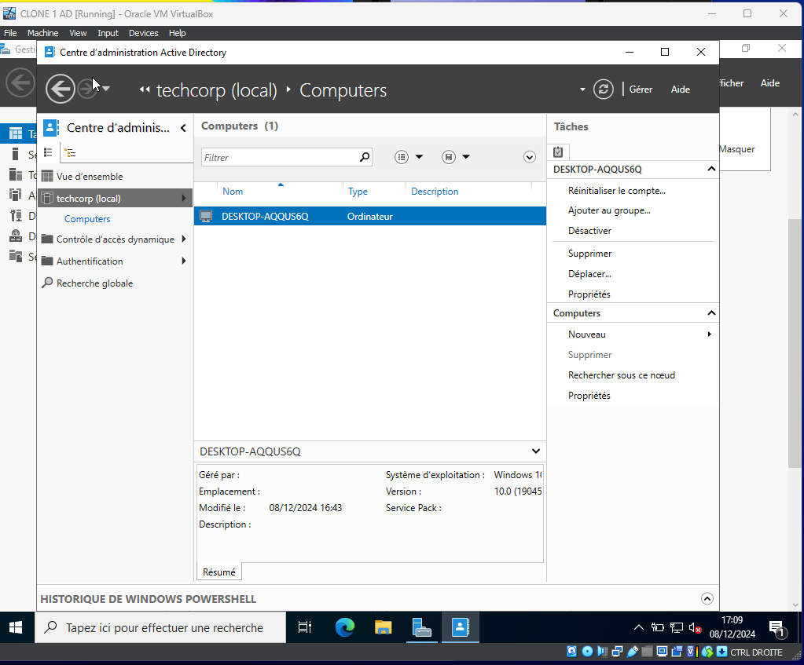

## 2. Configuration de l'Active Directory

### 2.1 Création d'unités d'organisation

Pour commencer, on va créer des unités d'organisation.  
Pour ce faire, il suffit de se rendre dans `Outils d'administration` > `Utilisateurs et ordinateurs Active Directory` > `techcorp.local`  
Là, on peut créer des unités d'organisation en faisant un clic droit sur `techcorp.local` > `Nouveau` > `Unité d'organisation`

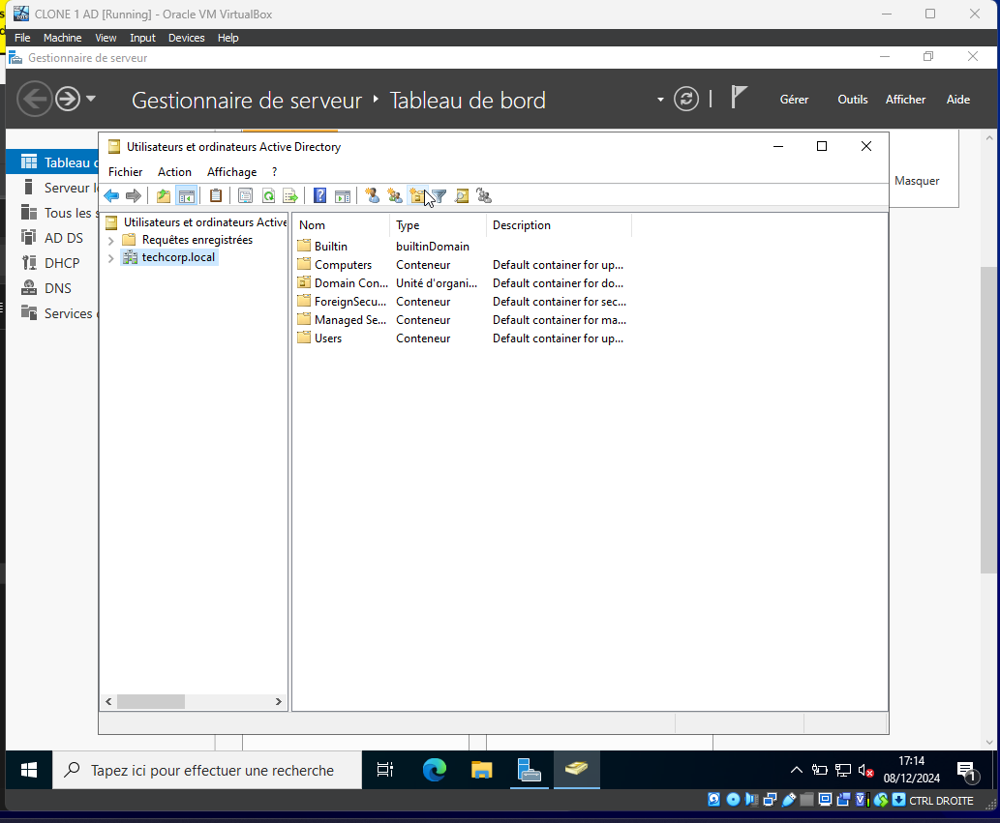

On indique le nom de l'OU, et on clique sur `OK`.

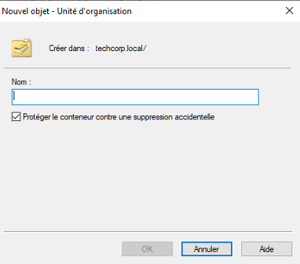

### 2.2 Ajout d'utilisateurs

On peut maintenant ajouter des utilisateurs.  
Pour cela, on se rend dans `techcorp.local` > `Utilisateurs` > `Nouveau` > `Utilisateur`

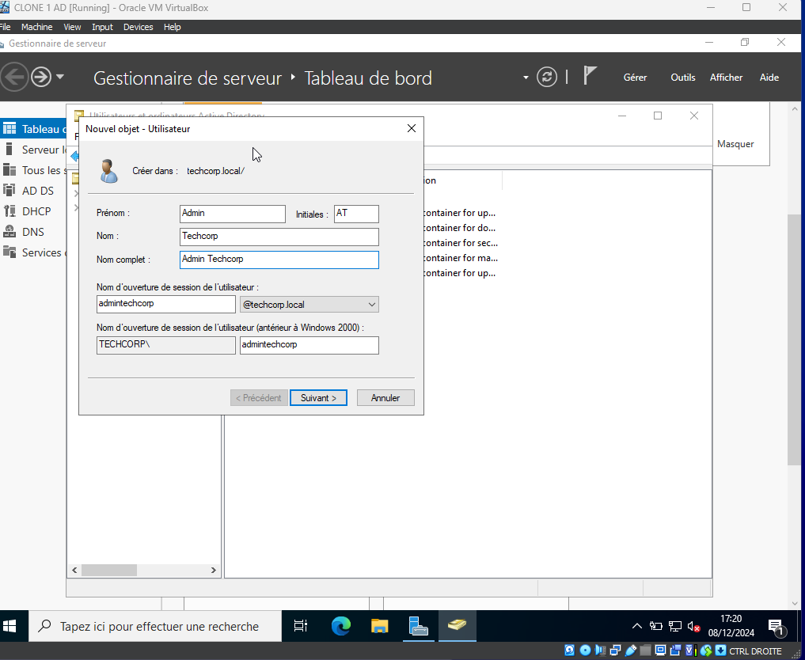

Là, on indique les informations de l'utilisateur, et on clique sur `Suivant`.  
On peut ensuite définir un mot de passe pour l'utilisateur, et cliquer sur `Suivant` puis `Terminer`.

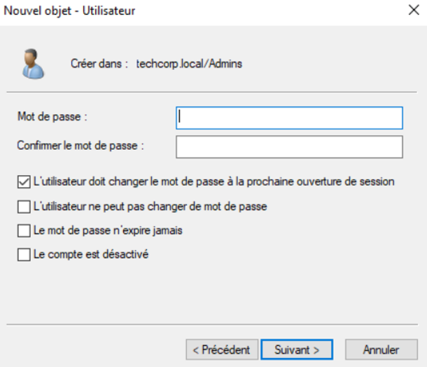

On peut donc créer plusieurs utilisateurs de cette manière.  
Passons rapidement en revue les utilisateurs créés.  

On rappelle le tableau donné : 

| Nom Complet  | Nom d'utilisateur |         Poste          |   Groupe AD   |          Email          | 
|:------------:|:-----------------:|:----------------------:|:-------------:|:-----------------------:|
| Marie Dupont |      mdupont      |     Responsable RH     |      RH       | mdupont@techcorp.local  |
| Paul Lambert |     plambert      | Chargé de recrutement  |      RH       | plambert@techcorp.local |
| Sophie Morel |      smorel       |    Gestionnaire RH     |      RH       | smorel@techcorp.local  |
| Claire Durand|     cdurand       |     Assistante RH      |      RH       | cdurand@techcorp.local |
| Jean Martin  |     jmartin       |     Responsable IT     |      IT       | jmarin@techcorp.local   |
| Alice Petit |     apetit        |  Technicienne réseau   |      IT       | apetit@techcorp.local |
| Thomas Leroy |     tleroy        |      Développeur       |      IT       | tleroy@techcorp.local |
| Karim Benaissa |  kbenaissa    | Administrateur système |      IT       | kbenaissa@techcorp.local |
| Support Technique | supporttech |   Support technique    |      IT       | supporttech@techcorp.local |
| Admin Techcorp | admintechcorp | Administrateur Domaine | Domain Admins | admin@techcorp.local |

On a donc 3 groupes :

| Nom du groupe |             Description             | Membres |
|:------------:|:-----------------------------------:|:----------------------:|
| RH | Accès aux dossiers et ressources RH | Marie Dupont, Paul Lambert, Sophie Morel, Claire Durand |
| IT | Accès aux dossiers et ressources IT | Jean Martin, Alice Petit, Thomas Leroy, Karim Benaissa, Support Technique |
| Domain Admins | Administrateurs du domaine | Admin Techcorp |

On peut donc créer les utilisateurs en conséquence.

Voilà les résultats après création des utilisateurs:

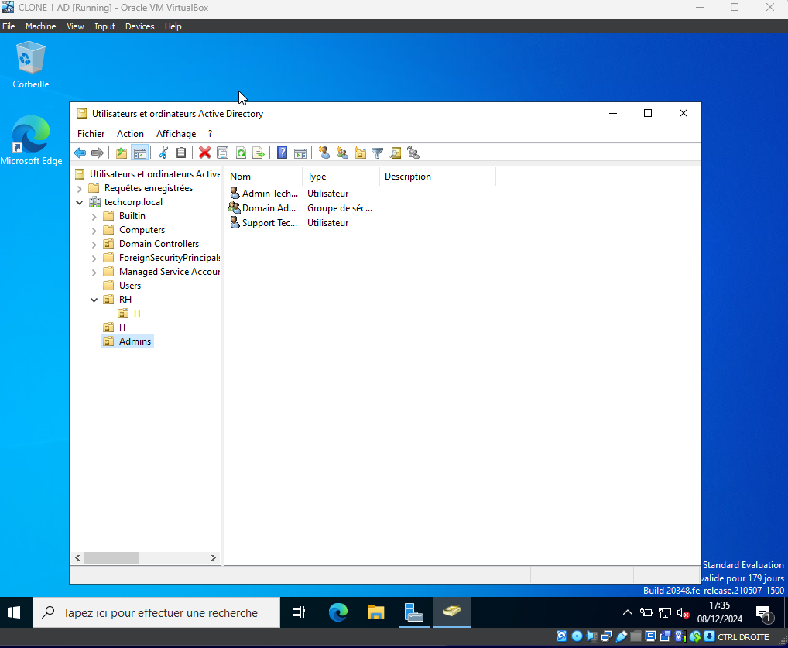

Ensuite, le groupe IT:

Et enfin, le groupe RH:

### 2.3 Création de groupes AD

Pour créer des groupes, on se rend dans `techcorp.local` > `Nouveau` > `Groupe`  

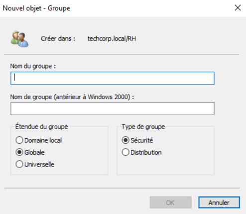
Là on indique le nom du groupe, et on clique sur `OK`.

Ensuite, on ajoute les membres du groupe en faisant un clic droit sur le groupe > `Propriétés` > `Membres` > `Ajouter`

Voici les résultats :

> Groupe Administrateurs du domaine

> Groupe IT

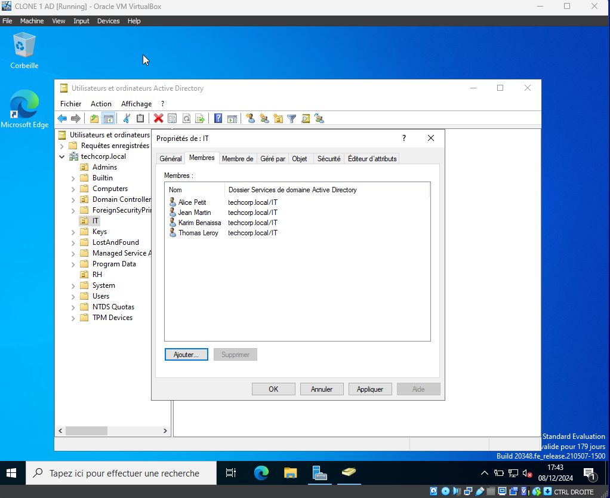

> Groupe RH

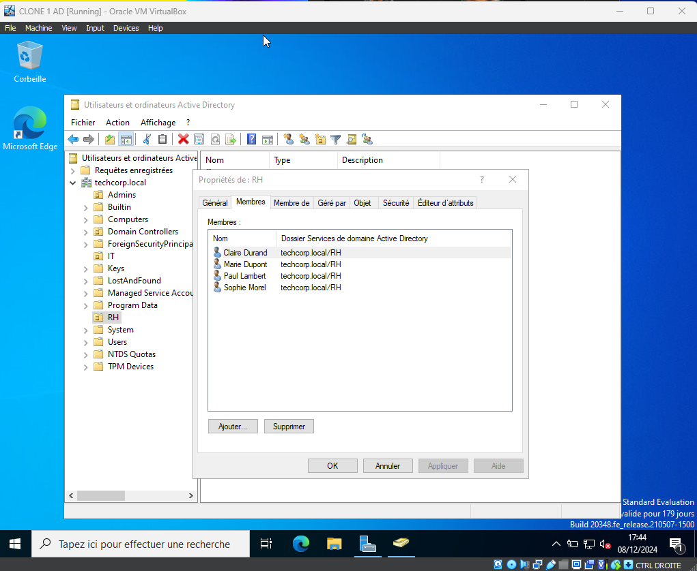

## 3. Configuration du service DNS

Configurons à présent le service DNS.  
Dans le gestionnaire de serveur, on se rend dans `Outils` > `DNS`

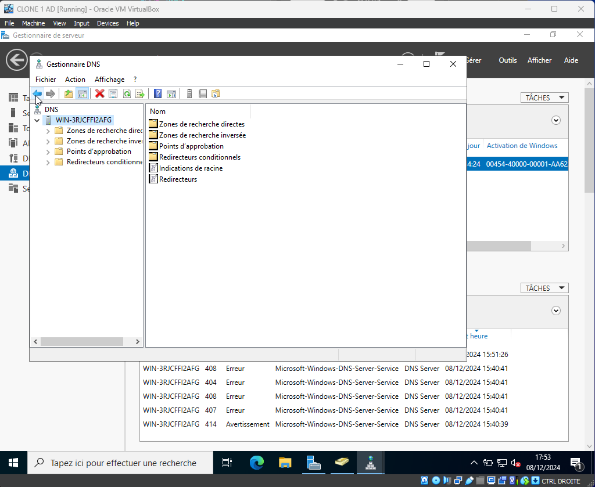

### 3.1 Configurer le redirecteur DNS

Une fois dans l'outil DNS, on fait un clic droit sur le serveur, et on clique sur `Rediecteurs conditionnels` > `Nouveau redirecteur conditionnel`  
On ajoute les ip voulues (`1.1.1.1`, cloudflare et `8.8.8.8`, google) et on clique sur `OK`.  

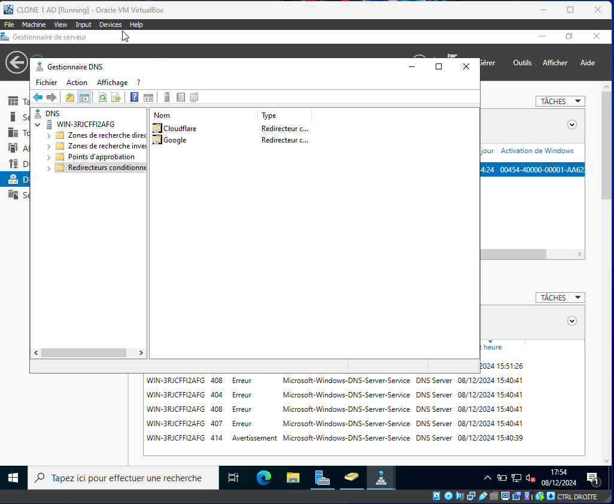

### 3.2 Ajout d'enregistrement DNS

On peut ajouter des enregistrements DNS en faisant un clic droit sur `techcorp.local` > `Nouvel Hôte (A ou AAAA)` > `Nom du domaine parent` (ici www) et on rensigne l'ip de la machine.

Après, On peut ajouter une zone de recherche inversée en faisant un clic droit sur `Zones de recherche inversée` > `Nouvelle zone` > `Zone de recherche inversée IPv4` > `Nouvelle zone` > `Zone principale` > `ipv4` > `ip du router (192.168.1.1)`

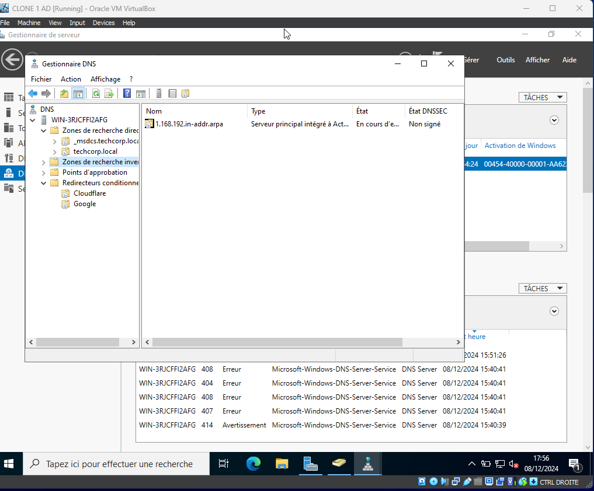

### 3.3 Test de résolution DNS

Pour tester la résolution DNS, on peut faire un `nslookup`. On vérifie que le serveur DNS est bien configuré en faisant un `nslookup` sur le nom du serveur.  

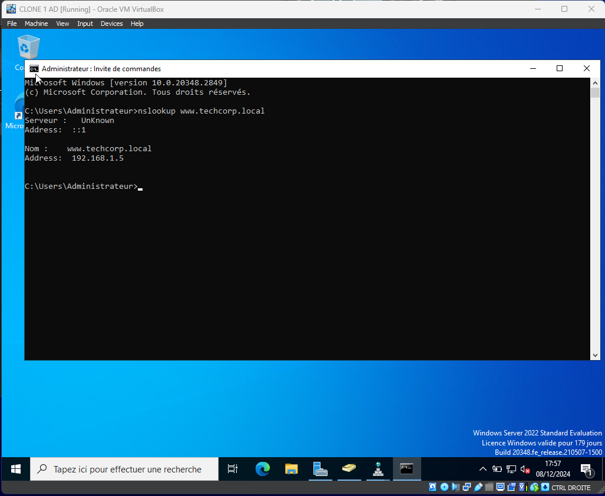

On voit que la résolution fonctionne bien.

## 4. Configuration du service DHCP

